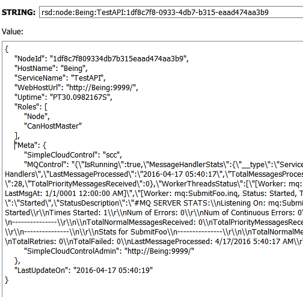

[](https://ci.appveyor.com/project/rsafier/servicestack-Simplecloudcontrol)
[](https://badge.fury.io/nu/ServiceStack.SimpleCloudControl)
## ServiceStack.SimpleCloudControl

A series of plugins for [ServiceStack](https://servicestack.net/) which enhance the functionality of [`ServiceStack.Discovery.Redis`](https://github.com/rsafier/ServiceStack.Discovery.Redis) [](https://badge.fury.io/nu/ServiceStack.Discovery.Redis) by providing cluster awareness to additional aspects of your ServiceStack AppHost's internal state.

### Quick Start
```c#
public override void Configure(Container container)
{
    //Standard ServiceStack.Discovery.Redis setup
    container.Register<IRedisClientsManager>(new RedisManagerPool("localhost:6379", new RedisPoolConfig { MaxPoolSize = 100, }));
    SetConfig(new HostConfig
    {
        WebHostUrl = "http://localhost:9999/"
    });
    Plugins.Add(new RedisServiceDiscoveryFeature());
    //Should load after RSD
    Plugins.Add(new SimpleCloudControlFeature());
    Plugins.Add(new SimpleMQControlFeature());
    Plugins.Add(new SimpleMQControlFeature());
    Plugins.Add(new SimpleHybridCacheFeature(new Regex("sess:.*|urn:iauthsession:.*|lock:.*", RegexOptions.Compiled))); //Applying filter on those keys to not keep a shadowed copy and always pull from Redis
    Plugins.Add(new SimpleCloudControlAdminFeature()); //Only add if you wish public access to administrative services 
}
```
Setup AppHost
#### SimpleCloudControlFeature (Required)
Provides a shared Redis PubSub channel for all other features to communicate with the cluster. It does this by exposing a 
`public void SendMessage(object dto)` method which allows for standard DTO to be sent to all nodes on the SCC cluster and when received run thru the standard `HostContext.AppHost.ExecuteService(requestDto)` processing loop.
#### SimpleMQControlFeature
Allows cluster administrator to have ability to manage real-time MQ control (stop/start) and status reporting for `IMessagingService` implemented queues. MQ services can be targeted by specific NodeId or HostName. This can be useful when having to take hosts in/out of load balancers but still need to shutdown or startup MQ services gracefully). This is done by sending a `SimpleMQControlRequest` DTO to an active SCC Admin Node which will forward via PubSub to all active MQ agents.
#### SimpleHybridCacheFeature (ICacheClientExtended implementation) - ported, not tested
Uses SCC PubSub for local cache consistancy with Redis across cluster. Practical use can be found when one cannot run a local Redis instances where your Services run, but are retrieving the same nearly static lookup tables on a rapid basis (I had servers starting to hit peak bandwidths in the 500Mbit range, after switching to hybrid cache peaks rarely exceed 100Mbit, obviously this is application specific and your mileage my vary)
Because there is inherently some delay by shadowing, and you lose the full atomic nature of Redis, for many keys this is an acceptable trade off. For those keys which you know must remain atomic a Regex blacklist filter can be provided on startup `BlackListKeysRegex`.

#### SimpleCloudConfig (IAppSettings Implementation) - incomplete, not tested
Provides a Redis-backed IAppSettings datastore which has multiple scopes which AppSettings may be defined.

- Tier (standard IAppSetting feature)
- HostName (per machine configuration)
- ServiceName (per Service configuration)

Data value for requested key will be first to be found in order of most specific to least: 

Machine & Service, Service, Machine, and Basic key scopes (if `Tier` is not null, then the same set of values with Tier are checked first)

#### SimpleCloudControlAdminFeature - incomplete, functional for MQControl
Most SCC features will not expose their DTOs beyond `InProcess` and only receive requests via the SCC control PubSub. The Admin feature provides the AppHost the ability to administrate the SCC Cluster using HTTP interface.


#### Other
Screenshot showing Node Redis key when populated with additional items in `IMeta` collection



